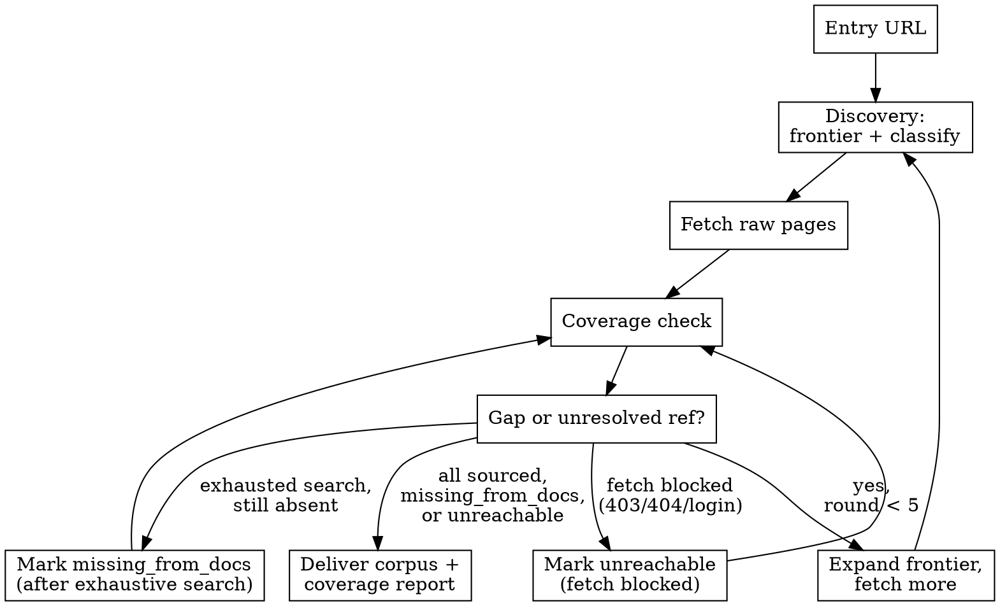

# Strict API Extraction

## Core Rule

Collect every official documentation page needed to produce a complete API schema. Until coverage is satisfied, keep discovering and fetching pages from the docs site. Never guess undocumented fields, types, enums, defaults, status codes, or auth requirements.

**Violating the letter of these rules is violating the spirit of these rules.**

## When to Use

- Building or regenerating OpenAPI 3.x / OpenRPC 1.x from official docs
- Verifying that scraped docs are sufficient before schema assembly
- Official docs are fragmented across reference pages, schema pages, auth guides, and error catalogs

## When NOT to Use

- A complete, trusted machine-readable spec already exists — pin and use it directly
- The task is only client codegen from an existing spec — use api-client-generator
- The task is general docs ingestion without schema completeness requirements — use firecrawl-knowledge-ingest

## Scope Boundary

This skill delivers an evidence-complete page corpus and coverage report. Schema assembly (writing openapi.yaml or openrpc.json) is a separate downstream step. State this boundary at task start when the user asks to "reconstruct" or "generate" a spec.

## Loop Contract

Run at most five discovery rounds. Track explicitly:

| Field | Meaning |
| --- | --- |
| `round` | 1 through 5 |
| `frontier` | URLs classified as include/defer, not yet fetched |
| `corpus` | Fetched raw pages with URL, title, role, fetched-at, format, content |
| `sourced` | Checklist item confirmed by corpus evidence with source URL |
| `unresolved_ref` | Cross-references without a corpus page yet |
| `unreachable` | URL attempted but blocked (403, 404, login wall, repeated fetch failure) |
| `missing_from_docs` | Exhaustive search completed; official docs silent |

Stop early when every checklist item is `sourced`, `missing_from_docs`, or `unreachable`. Stop after round 5 even if gaps remain, and report unresolved items instead of starting round 6.

Increment `round` each time step 2 (Discovery) is re-entered. The first pass through step 2 is round 1.

`unreachable` is not `missing_from_docs`. Do not guess content for unreachable URLs. Record attempted URLs and failure reason.

At round 5, any remaining `unresolved_ref` must be reclassified before stopping:
- Mark `unreachable` if fetch was attempted and blocked
- Otherwise mark `missing_from_docs` with note "round limit reached; not exhaustively searched"

## Workflow

1. **Identify target schema dialect.**
   - REST → OpenAPI 3.x
   - JSON-RPC → OpenRPC 1.x
   - Mixed or unclear → determine from docs navigation before fetching

2. **Discovery — build the URL frontier.**
   - Start from the official API docs entry URL
   - Enumerate sidebar, reference index, version branches, pagination, search, and cross-links
   - Prefer firecrawl-map for public sites; use firecrawl-interact or browser navigation for JS-heavy or auth-gated portals
   - Classify each URL: `include`, `exclude`, or `defer` (see Page Scope)

3. **Fetch — collect raw pages.**
   - Store each page as raw evidence: URL, title, role (endpoint-ref / schema / auth / errors / webhook), fetched-at, format (markdown/html), full content
   - Preserve code blocks, tables, and parameter lists verbatim
   - Follow unresolved cross-references ("see User object", "Authentication guide") by adding linked URLs to the frontier

4. **Coverage check — compare corpus against the checklist.**
   - For every endpoint/method, parameter, request body, response, schema, auth scheme, and documented error: confirm a source page exists or mark `missing_from_docs`
   - Flag `unresolved_ref` when a page references another doc section not yet in the corpus

5. **Close gaps — loop until done or round limit reached.**
   - `unresolved_ref` or checklist gap with no verdict → return to step 2 if `round < 5`
   - After two failed fetch attempts for the same URL → mark `unreachable`, do not retry indefinitely
   - After round 5 with remaining gaps → stop and report unresolved items
   - Do not proceed to schema assembly while unresolved gaps remain (excluding `unreachable` with documented failure)

6. **Deliver corpus + coverage report.**
   - Schema assembly is a separate downstream step; this skill stops at evidence-complete corpus



## Page Scope

**Include:**
- API reference, endpoints, methods, operations
- Request/response schema pages, object/type definitions
- Authentication, authorization, scopes, API keys
- Error codes, error response formats
- Webhooks, callbacks, subscriptions (if documented)
- Rate limits only when they define request/response contract details

**Exclude (unless they define schema elements):**
- Tutorials, quick starts, getting-started guides
- SDK usage examples without schema definitions
- Changelogs, blog posts, release notes
- Pricing, support, or marketing pages

**Defer then re-evaluate:**
- Concept/overview pages that link to reference sections
- Guides that embed field tables or request examples — include if they are the only source for a schema element

## Coverage Checklist

Before declaring the corpus complete, every item must be `sourced` or `missing_from_docs`:

| Element | Required evidence |
| --- | --- |
| Endpoint / RPC method | Name, HTTP method or RPC name, source URL |
| Parameters | Name, in (path/query/header/body), type, required/optional |
| Request body | Content-type, schema or field list |
| Responses | Each documented status code; body schema or explicit "no body" |
| Schemas / objects | Field names, types, required fields, enum values |
| Authentication | Scheme type, header/param name, scopes if applicable |
| Errors | Documented error codes or error object shape |
| Webhooks / callbacks | Event types, payload schema, delivery semantics |
| Rate limits | Request/response contract details when documented |
| Cross-references | Referenced pages present in corpus |

## No-Guess Rules

Forbidden without explicit documentation text:

- Inferring types from example values alone
- Inventing enum members not listed in docs
- Assuming required/optional when docs are silent
- Adding status codes not documented
- Filling default values not stated in docs
- Copying patterns from similar endpoints on the same site
- Using SDK source code or third-party specs as substitutes for official docs

When docs are silent after exhaustive search, record:

```yaml
element: parameters[?].format
status: missing_from_docs
searched:
  - https://docs.example.com/api/reference
  - https://docs.example.com/api/objects/user
exhausted: true
```

## Deliverable

```markdown
# Strict API Extraction: [API Name]

## Summary
- Target: OpenAPI 3.x | OpenRPC 1.x
- Entry URL: [url]
- Pages collected: [n]
- Coverage: [sourced n / total n checklist items]
- Unresolved: [n missing_from_docs] [n unreachable]

## Corpus Index
| URL | Title | Role | Fetched At |
| --- | --- | --- | --- |
| ... | ... | endpoint-ref / schema / auth / errors / webhook | ... |

## Coverage Report
| Element | Status | Source URL | Notes |
| --- | --- | --- | --- |
| GET /users | sourced | https://... | |
| User.email type | missing_from_docs | — | exhaustive search completed |

## Unresolved Items
[List every missing_from_docs and unreachable element with searched URLs and failure reason]

## Next Step
Corpus is ready for schema assembly. Do not assemble until user requests downstream work.
```

Store raw page content in a scratch `corpus/` directory outside version control (e.g. `.local/strict-api-extraction/corpus/`). Add the path to `.gitignore` when working inside a git repo. Never commit fetched third-party documentation.

## Rationalization Table

| Excuse | Reality |
| --- | --- |
| "The example shows it's a string" | Examples are not schema. Mark missing or find the type definition page. |
| "Other endpoints use the same pattern" | Pattern matching is guessing. Each element needs its own source. |
| "This is obviously required" | Required/optional must be documented or marked missing_from_docs. |
| "We have enough to start the spec" | Partial corpus produces partial spec. Continue fetching. |
| "SDK/types confirm the shape" | SDK is not official docs unless the task explicitly allows it. |
| "I'll note it as TBD in the spec" | TBD in spec = guessing in disguise. Keep it in coverage report only. |

## Red Flags — STOP

- Writing openapi.yaml / openrpc.json before coverage check passes
- Filling `type`, `enum`, `required`, or `default` without a source URL
- Stopping after the first N pages while sidebar or cross-refs remain unexplored
- Treating tutorial examples as normative schema
- Marking coverage complete with any `unresolved_ref` still open

**All of these mean: return to discovery/fetch. Do not guess.**

## Tooling

Select by capability. If a required tool is unavailable, report the gap and ask the user — do not invent tool calls.

| Capability | Preferred tools |
| --- | --- |
| URL discovery | firecrawl-map, firecrawl-search |
| Static page fetch | firecrawl-scrape |
| JS-heavy or auth-gated fetch | firecrawl-interact, browser navigation |
| Fallback (user-approved only) | WebFetch for single public pages when Firecrawl is unavailable |

Do not substitute memory, training data, or third-party specs for missing pages.
